<!-- Everything visual here is a hand-built animated SVG living in ./assets, generated to match megazron.com's HUD. -->

<a href="https://megazron.com"></a>

<a href="https://megazron.com"><b>Portfolio</b></a> · <a href="https://www.linkedin.com/in/gaus-mohiuddin-sayyad/">LinkedIn</a> · <a href="https://youtube.com/@MegaZron">YouTube</a> · <a href="https://scholar.google.com/citations?user=GXrd9PIAAAAJ&hl=en">Scholar</a> · <a href="https://megazron.medium.com">Medium</a> · <a href="mailto:gmsayyadsvc4@gmail.com">Email</a>


> **Hello · Assalamu Alaikum · नमस्ते · नमस्कार** &nbsp;— I'm Gaus, a Robotics Software Engineer finishing an **MSc in Human & Biological Robotics at Imperial College London** (Sep 2026, predicted Distinction).
> I build the layer where perception turns into action: **vision-language-action policies, deep RL controllers and real-time teleoperation** on real arms.
> The path here ran through a **CanSat launch**, an **atmospheric LiDAR lab at ISRO**, a **satellite-surveillance model at IIT Bombay**, a **VLA benchmarking pipeline at Huawei R&D UK**, two **Smart India Hackathon** wins and **three German patents** — and it started in Chhatrapati Sambhajinagar, India, where I graduated **Rank #1** in my department.

- **BASE** — London, UK · Imperial College London · UK Global Talent (GWR) visa eligible
- **CURRENT MISSION** — Multimodal dual-arm robot control — a 7-DoF master mannequin teleoperating two Kinova Gen3 arms on a wearable supernumerary-limb platform (ROS 2 · Kortex API · Isaac Lab)
- **FOCUS** — VLA policies · embodied AI · deep RL (SAC / PPO / ACT / diffusion control) · perception-to-action pipelines · brain-computer interfaces · neurorehabilitation
- **PREVIOUS ORBITS** — Huawei Technologies R&amp;D UK · ISRO NARL · IIT Bombay · Google Developer Student Clubs (Lead) · Astronautical Society of India
- **STATUS** — Graduating September 2026 · <b>open to robotics and embodied-AI roles</b>, research collaborations and interesting problems
- **MOTTO** — <i>Builds the impossible with science… because science works — 10 Billion Percent!</i>


**Dec 2025 – May 2026 · **Huawei Technologies R&D (UK)** · Robotics Software Engineer (RA)**  
Benchmarked VLA models (SmolVLA, OpenVLA, Octo, π0) across 9 prompt formats and 10 LIBERO-Spatial tasks; built a back-end that auto-generates relational graph datasets from 3D robot episodes with a unified loader for real-world Go2 HDF5 logs; designed the end-to-end evaluation architecture (inference registry, capability checker, automated plotting). Supervised by Dr. Haitham Ammar and Dr. Christopher Mower.

**Feb 2026 – Mar 2026 · **Imperial College London** · HBR Student Representative**  
Represented the MSc in Human & Biological Robotics at outreach events.

**Nov 2025 – Dec 2025 · **Imperial College London** · Research Assistant**  
Microfabrication on silicon wafers under Dr. Aritra Kundu: substrate prep, thin-film deposition, photolithography, etching, metallization.

**Jan 2025 – Jun 2025 · **IIT Bombay** · Research Intern (IIT Bombay Research Internship Award 2024-25)**  
*Satellites for Surveillance* with Dr. Indu J: a computational satellite-pass prediction model and a deep-learning model for real-time marine surveillance. Became **GeoTRACE**, published at IEEE InGARSS 2025.

**Apr 2024 – Jun 2024 · **ISRO · National Atmospheric Research Laboratory** · Summer Research Fellow (IASc · INSA · NASI)**  
Built an atmospheric LiDAR data-acquisition and processing system and applied ML to retrieve cloud parameters. Supervised by Dr. Y. Bhavani Kumar.

**Jul 2023 – Jun 2024 · **GDG on Campus, MGM University** · GDSC Lead**  
Led a team of 20 and mentored 800+ members across 12 events; Tier 1 in Google Cloud Study Jams; a club team reached the Top 100 of Solutions Challenge 2024.

**Aug 2022 – Apr 2024 · **Astronautical Society of India** · Team Leader**  
Led a team of 8 to build and launch a satellite in CanSat India 2022 (IN-SPACe / ASI) at U. R. Rao Satellite Centre, Bengaluru.

**Feb 2023 – Mar 2023 · **Space Technology and Aeronautical Rocketry** · Avionics Engineer Intern**  
Designed and analysed a static test pad for high-power rockets as the systems engineer integrating electronics and mechanics.

**Dec 2022 – Feb 2023 · **IEEE Young Professionals** · Full Stack Developer Intern**  
Built a real-time random agent generator and led the team.

<a href="https://github.com/megazron/Multimodal-control-of-a-wearable-dual-arm-robotic-system-for-assisted-object-manipulation"></a>

<a href="https://github.com/megazron/SAC-for-Multi-Functional-Assistive-Robotics-in-MuJoCo"></a>

<a href="https://github.com/megazron/Robot-Agent-Network-for-VLAs"></a>

<a href="https://github.com/megazron/eeg-operated-wheelchair"></a>

<a href="https://github.com/megazron/can-sat-for-debris-detection"></a>

<a href="https://github.com/megazron/autonmousdrone"></a>

Also in the hangar: <a href="https://github.com/megazron/Brain-Tumor-Detection-YOLO-Keras">Brain-Tumor-Detection-YOLO-Keras</a> · <a href="https://github.com/megazron/julia-licel-data-processor">julia-licel-data-processor</a> (the ISRO LiDAR toolchain) · <a href="https://github.com/megazron/greenhouse-gas-emissions-monitoring-app">greenhouse-gas-emissions-monitoring-app</a> · <a href="https://github.com/megazron/object_dimension_database">object_dimension_database</a> · <a href="https://github.com/megazron/DesktopCleaner">DesktopCleaner</a> · <a href="https://youtube.com/@MegaZron">demos on YouTube</a>

**Patents**

1. **Machine-learning-based EEG-signal-controlled wheelchair system** — Germany · DE202025101530U1 · 2025
2. **Coaxial drone system with two propellers** — Germany · DE202025102068U1 · 2025
3. **3D-printing rover system for on-site additive manufacturing** — Germany · DE202025102217U1 · 2025
4. **Dielectric spectroscopy sensor system for measuring liquid dielectric constant** — South Africa · ZA 2023/01848 · 2023
5. **Embedded system for humidity, soil-moisture and temperature measurement in polyhouses** — South Africa · ZA 2023/02620 · 2023
6. **Dielectric constant measurement — dielectric spectroscopy sensor** — India · 540,791 · 2023

**Publications**

- **GeoTRACE: Geospatial TLE-Based Regional Analysis and Computational Engine for Surveillance** — G. M. Sayyad, J. Indu · *IEEE India Geoscience and Remote Sensing Symposium (InGARSS)*, pp. 177–183 · 2025
- **Surface Clay and Mineral Exploration Using Hyperspectral Imaging** — *ISPRS Annals of Photogrammetry, Remote Sensing and Spatial Information Sciences* · 2025
- **Retrieval of Atmospheric Cloud Parameters Using Infrared Laser LiDAR Data Integrated with Machine Learning** — G. M. Sayyad, Y. Bhavani Kumar · *International Conference on Climate Change* · 2025
- **Flood Mapping using Microwave Remote Sensing** — *International Journal of Scientific Research in Science and Technology* 11 · 2024

Full record on <a href="https://scholar.google.com/citations?user=GXrd9PIAAAAJ&hl=en">Google Scholar</a>.

- 🏆 **Winner — Smart India Hackathon 2024** — National · Dec 2024
- 🏆 **Winner — Smart India Hackathon 2023** — National · coaxial surveillance drone
- 🛰️ **Winner — CanSat Competition 2022** — IEEE-AESS · LiDAR debris-detection satellite
- 🥇 **Shishyottam Puraskar — Best Student Award** — MGM University · Jan 2025
- 🔬 **Summer Research Fellowship 2024** — IASc · INSA · NASI, hosted at ISRO NARL
- 🎓 **IIT Bombay Research Internship Award 2024-25** — Satellites for Surveillance
- 🚀 **Grand Finalist — CanSat India** — IN-SPACe & Astronautical Society of India · 2024
- ⚛️ **Grand Finalist — Quantum Hackathon 2022** — plus Qiskit Badge of Quantum Excellence
- 🌟 **Featured as a Notable Alumni** — Ministry of Education's Innovation Cell · Aug 2024

<b>Open the full log (53 entries)</b>

 

- Felicitated by MGM University at Razzmatazz 2025 for winning Smart India Hackathon three times in a row
- Top 20 Poster Presentation — JNEC Internship Day 2025, featured in नवभारत
- Presented research at IIT Bombay's internship poster session (Satellites for Surveillance) · May 2025
- Award certificate — IIT Hyderabad's Research Opportunities in Computer Architecture · Jul 2025
- Invited to Google I/O Connect Bangalore (invite-only) for contributions to the Google developer community
- Invited to Google's Bangalore office for GDSC Leads AI Day; featured in a Google for Developers advertisement
- Awarded at Google DevFest as GDSC Lead and community contributor; recognised by Women Techmakers on International Women's Day 2024
- Invited to the GDSC India Regional Bootcamp at VIT Mumbai; podcast guest on the Google Developers Community platform
- Top 5 at IDE Bootcamp 2024, NIT Mysore — pitched the SIH'23 winning project to the jury
- Selected to attend the India Science Festival 2024; participant, IEEE GRSS Summer School 2024 on Digital Agricultural Technologies
- Felicitated by the ECT Department for multiple recognitions (GDSC Lead, ISRO Fellowship, SIH'23 Winner) · Aug 2024
- 5th-semester topper — parents felicitated by the ECT Department, MGM University
- Class Representative, ECT Department, for securing Rank #1 among all students
- Presented *Quantum Traffic Optimization Using Quantum Gates* at MGM Anveshan 2023
- Organised the Space Tech Hackathon at MGM University on its Foundation Day
- Presented *Retrieval of Atmospheric Parameters* (Paper ID 183); workshops on SAR data analysis and emerging trends in remote sensing
- Letter of Recommendation — STAR Internship (avionics)
- Featured in multiple newspaper articles for the SIH 2023 victory and the GDSC event *Code Crusaders*

Every entry, with issuer and date, lives on <a href="https://megazron.com/#awards">megazron.com</a>.



  

  

  <a href="https://megazron.com">megazron.com</a>  · 
  <a href="https://www.linkedin.com/in/gaus-mohiuddin-sayyad/">LinkedIn</a>  · 
  <a href="https://youtube.com/@MegaZron">YouTube</a>  · 
  <a href="https://scholar.google.com/citations?user=GXrd9PIAAAAJ&hl=en">Google Scholar</a>  · 
  <a href="https://megazron.medium.com">Medium</a>  · 
  <a href="https://topmate.io/megazron">Topmate</a>  · 
  <a href="mailto:gmsayyadsvc4@gmail.com">gmsayyadsvc4@gmail.com</a>

